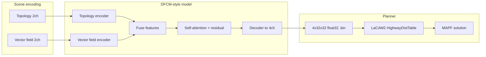
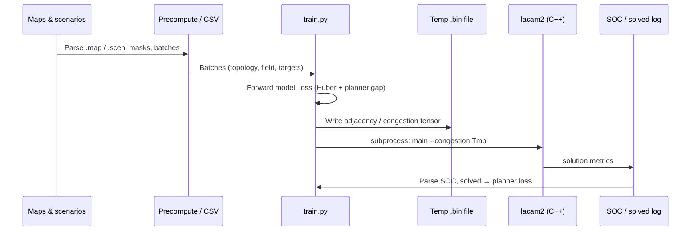

# FlowLaCAM*

**Learning directional congestion forecasts for congestion-aware multi-agent pathfinding**

[](./Thesis.pdf.pdf)
[](https://www.python.org/)
[](https://pytorch.org/)
[](https://isocpp.org/)

This repository accompanies a **Master’s thesis (FIT5128)** on combining a **deep learning congestion model** with a **modified LaCAM2** solver for **Multi-Agent Path Finding (MAPF)** on grids. The goal is to predict **how “crowded” each move direction is** from map layout and intended flow, then let the planner **prefer smoother, less conflicting routes** while preserving feasibility.

> **Open-source note:** Large raw datasets and some local build paths are environment-specific. This README is written so employers and contributors can understand the *research story*, *architecture*, and *how pieces connect* without needing the author’s machine layout. Replace placeholder paths when you clone the repo (see [Configuration notes](#configuration-notes)).

---

## Table of contents

- [Thesis and research problem](#thesis-and-research-problem)
- [What this repository contains](#what-this-repository-contains)
- [Method overview](#method-overview)
- [Architecture (concept + code)](#architecture-concept--code)
- [End-to-end pipeline](#end-to-end-pipeline)
- [Main technical strategies](#main-technical-strategies)
- [Results and figures](#results-and-figures)
- [Repository layout](#repository-layout)
- [Getting started](#getting-started)
- [Configuration notes](#configuration-notes)
- [Citation](#citation)
- [License](#license)

---

## Thesis and research problem

**Multi-Agent Path Finding (MAPF)** asks for collision-free paths for many agents on a graph or grid. Classical solvers (e.g. CBS, LaCAM/LaCAM2) are strong at feasibility and speed, but they typically treat **edge costs uniformly** unless extended.

This work investigates **learned, direction-specific congestion signals**: a model maps **topology** (where agents and goals sit on the map, obstacles) and a **vector field** (aggregate desired flow from starts toward goals) to **four directional congestion maps** (east, west, north, south). Those maps are consumed by a **congestion-aware distance table** inside LaCAM2 so backward search uses **non-uniform edge costs** aligned with predicted bottlenecks.

**Problem statement (plain language):**  
*Can we learn a cheap geometric prior over “which directions will be busy” from a snapshot of the scene, and inject it into a state-of-the-art MAPF planner so that solutions improve in sum-of-costs (SOC) or robustness—without breaking the planner’s core logic?*

**Thesis artifacts in this folder**

| Asset | Purpose |
|--------|---------|
| [`Thesis.pdf.pdf`](./Thesis.pdf.pdf) | Full thesis document |
| [`FIT5128– Master’s Thesis presentation.pdf`](./FIT5128–%20Master’s%20Thesis%20presentation.pdf) | Defence / overview slides |
| [`pics/`](./pics/) | Figures for architecture, inputs/outputs, training curves, occupancy analysis |

---

## What this repository contains

| Component | Role |
|-----------|------|
| **`src/`** | PyTorch model (`DualInputTopologyVectorFields`), input construction (topology + vector fields), training helpers, advisory congestion utilities |
| **`scripts/`** | Training with **planner-in-the-loop** loss, preprocessing, inference handoff, adaptive re-planning experiments, evaluation scripts |
| **`lacam2/`** | C++ **LaCAM2** library extended with **`HighwayDistTable`**: loads a `4 × 32 × 32` float32 binary congestion tensor and adds per-move costs during backward Dijkstra |

There is **no `requirements.txt`** in the tree yet; dependencies are standard scientific Python plus PyTorch (see [Getting started](#getting-started)).

---

## Method overview

1. **Encode the scene** as two aligned 2-channel grids: **topology** (e.g. starts/goals/obstacles) and **vector field** (flow toward goals).
2. **Predict** four per-cell, per-direction congestion values in `[0, 1]` (sigmoid on the decoder).
3. **Serialize** predictions as a raw binary file: `float32`, shape **`(4, 32, 32)`**, channel order consistent with the C++ edge-cost mapping.
4. **Run LaCAM2** with `--congestion` pointing at that file; the planner’s distance lookups add congestion to the relevant directed edge.



---

## Architecture (concept + code)

### High-level framework (thesis-style diagram)

The following figure summarizes the **FlowLaCAM\*** idea: a **directional congestion model** feeds a **congestion-aware LaCAM2** solver.


### Model design (dual stream → attention → decoder)

The implementation uses **two convolutional encoders**, **feature fusion** (concatenation in code), a **self-attention block** with a residual scaling parameter, and a **transposed-convolution decoder** to recover a `32×32` grid with **4 output channels**.


**Code anchor (model class):** the network is `DualInputTopologyVectorFields` in [`src/utils_congestion_models.py`](src/utils_congestion_models.py): separate `ConvBlock` stacks for topology and vector field, concatenation, `SelfAttentionBlock`, then `Decoder` with sigmoid outputs.

### What the solver does with the tensor

`HighwayDistTable` in [`lacam2/src/dist_table.cpp`](lacam2/src/dist_table.cpp) reads **exactly** `4 × 32 × 32` floats and, for each neighbor expansion during backward Dijkstra, adds a **congestion increment** to the base edge cost of `1.0`, using the channel that matches the move direction (east/west/north/south mapping is documented in code next to `edge_costs`).

---

## End-to-end pipeline



**Inference handoff:** [`scripts/real_time_inference_handoff.py`](scripts/real_time_inference_handoff.py) documents a path from a **single map + scenario** to **model input** and saved artifacts (for deployment-style use, not training).

**Adaptive variant:** [`scripts/adaptive_flowlacam.py`](scripts/adaptive_flowlacam.py) sketches **re-predicting congestion** as the joint plan evolves (intermediate solutions), aligning the advisory field with remaining agents.

---

## Main technical strategies

### 1. Directional Flow Congestion Model (DFCM-style)

- **Dual inputs** capture *where* agents are going (topology) and *which way the crowd wants to move* (aggregate vector field from starts to goals).
- **Attention** over fused spatial features highlights long-range bottlenecks on small grids (e.g. corridors).
- **Sigmoid outputs** keep per-direction costs bounded and easy to plug into the planner.

### 2. Congestion-aware LaCAM2 (`HighwayDistTable`)

- Replaces uniform backward distances with **weighted** distances when a congestion file is supplied.
- **Binary format:** row-major per channel, `float32`, fixed `32×32` in the current reader (see `edgeMatrix` in `dist_table.cpp`).

### 3. Training: supervised signal + planner in the loop

[`scripts/train.py`](scripts/train.py) implements:

- **`SpatialCongestionLoss`:** Huber loss on predicted vs target **adjacency / congestion** tensors (robust regression).
- **Planner gap loss:** run LaCAM2 with the predicted tensor, parse **sum-of-costs (SOC)** and **solved** flag from planner output, and compare against a **baseline SOC** (e.g. from reference solvers recorded in metadata) so the model is rewarded for **maps that actually help the planner**.

Configuration in the script mentions a **multi-stage curriculum** (e.g. adjacency-focused phases vs planner-dominant phases). You can tune `STAGE_*_EPOCHS`, `PLANNER_BATCH_PROB`, and loss weights for ablations.

### 4. Data and precomputation

Scripts under [`scripts/`](scripts/) handle:

- Consolidating scenarios, building **occupancy** or **heatmap** targets from solution traces (e.g. [`scripts/build_occupancy_heatmap_solution.py`](scripts/build_occupancy_heatmap_solution.py)).
- Precomputed batch directories for fast dataloader access (`precompute_*.py`).

### 5. Evaluation and comparison

- [`scripts/post_process_compare_results.py`](scripts/post_process_compare_results.py) and [`scripts/post_process_compare_results_extensive.py`](scripts/post_process_compare_results_extensive.py) support **batch comparison** of runs.

---

## Results and figures

### Inputs and learned directional maps

The model turns **start / goal channels** and a **quiver-style vector field** into **per-direction** heatmaps (east, west, north, south). This visualization matches the tensor that the C++ side interprets as directional edge congestion.


### Training curriculum (example run)

The project uses **staged training** so the network first learns meaningful spatial structure, then aligns with **planner outcomes**. The curve below is representative of **adjacency loss**, **planner-related loss**, and a **validation gap** metric over epochs (exact definitions are in the thesis and training logs).


### Occupancy reconstruction (auxiliary / analysis)

Some experiments compare **raw occupancy-like grids**, **model reconstruction**, and **ground truth** heatmaps—useful for sanity-checking that spatial structure is preserved under noise.


### Video demos

No video files are bundled in the repository. If you publish a short screen recording (e.g. planner + heatmap overlay), add a link here:

```markdown
- [Demo video](https://example.com/your-demo) — optional walkthrough
```

---

## Repository layout

```
FlowLaCAM-/
├── README.md                 ← You are here
├── Thesis.pdf.pdf
├── FIT5128– Master’s Thesis presentation.pdf
├── pics/                     ← Figures for docs / README
├── src/
│   ├── utils_congestion_models.py   # DualInputTopologyVectorFields, attention, decoder
│   ├── utils_advisory_congestion_input.py
│   ├── utils_arranging_raw_data.py
│   ├── utils_train.py
│   └── ...
├── scripts/
│   ├── train.py              # Main training + LaCAM subprocess hook
│   ├── train_stage3.py
│   ├── adaptive_flowlacam.py
│   ├── real_time_inference_handoff.py
│   ├── data_preprocess*.py
│   ├── precompute_*.py
│   ├── test.py / test_.py
│   └── ...
└── lacam2/
    ├── CMakeLists.txt        # Builds static library `lacam2`
    ├── include/
    └── src/
        ├── dist_table.cpp    # Congestion file loading + HighwayDistTable
        ├── planner.cpp
        └── ...
```

**Note:** [`scripts/train.py`](scripts/train.py) references a **driver binary** `lacam2/build/main` in examples. This repository snapshot exposes the **library** via CMake; you may need a small `main` that parses CLI args and calls `solve(...)` from [`lacam2/include/lacam2.hpp`](lacam2/include/lacam2.hpp). That glue file is a natural first contribution if you want the repo fully turnkey.

---

## Getting started

### Prerequisites

- **Python** with **PyTorch**, **NumPy**, **pandas**, **matplotlib**, **tqdm**, **scipy**, **seaborn** (as used across `scripts/` and `src/`).
- **C++17** compiler and **CMake** ≥ 3.16 for `lacam2`.

### Build the C++ library

```bash
cd lacam2
cmake -B build -DCMAKE_BUILD_TYPE=Release
cmake --build build
```

Link your executable against the static library `lacam2` and implement CLI flags compatible with your training script (`--map`, `--scen`, `--num`, `--congestion`, `--output`, etc.), or adapt `run_lacam_in_wsl` in `train.py` to your binary name and paths.

### Python environment (suggested)

```bash
python -m venv .venv
source .venv/bin/activate   # or .venv\Scripts\activate on Windows
pip install torch numpy pandas matplotlib tqdm scipy seaborn
```

Add a **`requirements.txt`** or **`pyproject.toml`** when you pin versions for reproducibility.

### Typical workflows

| Goal | Entry point |
|------|-------------|
| Train with planner feedback | `scripts/train.py` (after data + paths configured) |
| Single-scenario inference | `scripts/real_time_inference_handoff.py` |
| Adaptive replanning experiment | `scripts/adaptive_flowlacam.py` |
| Occupancy from solution file | `scripts/build_occupancy_heatmap_solution.py` |

---

## Configuration notes

- **Absolute paths:** Some scripts contain machine-specific directories (e.g. historical WSL or VM shared paths). For a **portable** setup, centralize roots in one config or environment variables.
- **Grid size:** The congestion binary reader is fixed to **32×32** in [`lacam2/src/dist_table.cpp`](lacam2/src/dist_table.cpp). Generalizing to arbitrary map sizes would require coordinated changes in Python tensor export and C++ `edgeMatrix`.
- **Data layout:** Expect under `data/` (not fully in git): raw `.map` / `.scen`, CSV metadata, precomputed batches, and planner outputs. Document your dataset source (e.g. MAPF benchmarks) in a `DATA.md` when you publish.

---

## Citation

If you use this code or idea in academic work, cite the **thesis** (author, title, institution, year as in `Thesis.pdf.pdf`) and the **original LaCAM / LaCAM2** papers as appropriate. Example BibTeX skeleton (fill in from your thesis title page):

```bibtex
@mastersthesis{flowlacam2025,
  author  = {[Author Name]},
  title   = {FlowLaCAM*: [Thesis Title]},
  school  = {Monash University},
  year    = {2025},
  type    = {Master's thesis},
  note    = {Code: \url{https://github.com/[your-org]/FlowLaCAM-}}
}
```

---

## License

Specify a license (e.g. MIT, Apache-2.0) in a `LICENSE` file before wide distribution. Until then, **all rights reserved** unless you state otherwise in the repository settings.

---

## Acknowledgements

- **LaCAM2** planner lineage and MAPF community benchmarks.
- Supervisors and reviewers named in the thesis document.

---

*README generated to summarize the research codebase; refine numbers, benchmarks, and citations from the thesis PDF when publishing.*
