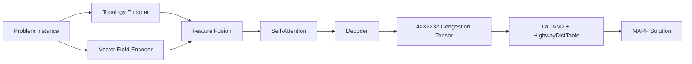

# FlowLaCAM*

**Learning directional congestion forecasts for congestion-aware multi-agent pathfinding**

[](./Thesis.pdf.pdf)
[](https://www.python.org/)
[](https://pytorch.org/)
[](https://isocpp.org/)

---

## Overview

FlowLaCAM* is a novel approach to Multi-Agent Path Finding (MAPF) that combines deep learning with classical planning. This repository contains the implementation accompanying a Master's thesis (FIT5128) from Monash University.

**Key Innovation:** We predict direction-specific congestion from the problem topology and agent flow patterns, then use these predictions to guide a state-of-the-art LaCAM2 planner toward smoother, less conflicting paths without sacrificing feasibility.

### Research Problem

Classical MAPF solvers (CBS, LaCAM, LaCAM2) excel at finding feasible collision-free paths quickly but typically treat all edges uniformly. Can we learn where bottlenecks will occur and inject this knowledge into a planner to improve solution quality?

**Our approach:**
1. Train a neural network to predict per-direction congestion (east, west, north, south) from:
   - **Topology**: Agent start/goal positions and obstacles
   - **Vector field**: Aggregate desired flow directions
2. Feed predictions into a modified LaCAM2 solver that uses direction-weighted costs during search
3. Achieve better sum-of-costs (SOC) and solution robustness while maintaining completeness

> **Note:** This is research code written for thesis work. Some paths are environment-specific. See [Configuration](#configuration-notes) for setup guidance.

---

## Table of Contents

- [Architecture](#architecture)
- [Repository Structure](#repository-structure)
- [Getting Started](#getting-started)
- [Method Overview](#method-overview)
- [Training](#training)
- [Results](#results)
- [Citation](#citation)
- [License](#license)
- [Acknowledgments](#acknowledgments)

---

## Architecture

### System Overview



### Model Components

**Network:** `DualInputTopologyVectorFields` ([`src/utils_congestion_models.py`](src/utils_congestion_models.py))
- Dual convolutional encoders process topology and vector fields separately
- Feature fusion via concatenation
- Self-attention layer captures long-range spatial dependencies
- Transposed-convolution decoder outputs 4-channel (directional) congestion maps
- Sigmoid activation ensures bounded costs ∈ [0,1]

**Solver Integration:** `HighwayDistTable` ([`lacam2/src/dist_table.cpp`](lacam2/src/dist_table.cpp))
- Reads 4×32×32 float32 binary congestion tensor
- Augments backward Dijkstra search with direction-specific edge costs
- Maintains LaCAM2's optimality and completeness guarantees


*Figure: FlowLaCAM* architecture - dual-stream encoder with attention feeding congestion-aware planner*

---

## Repository Structure

```
FlowLaCAM-/
├── README.md                  # This file
├── Thesis.pdf.pdf             # Full thesis document
├── FIT5128–Master's Thesis presentation.pdf
├── pics/                       # Figures and diagrams
│
├── src/                        # Python source code
│   ├── utils_congestion_models.py      # Neural network models
│   ├── utils_advisory_congestion_input.py
│   ├── utils_arranging_raw_data.py
│   └── utils_train.py
│
├── scripts/                    # Training and evaluation
│   ├── train.py               # Main training loop with planner-in-the-loop
│   ├── real_time_inference_handoff.py
│   ├── adaptive_flowlacam.py  # Dynamic replanning experiments
│   ├── build_occupancy_heatmap_solution.py
│   └── precompute_*.py        # Data preprocessing
│
└── lacam2/                     # Modified LaCAM2 solver (C++)
    ├── CMakeLists.txt
    ├── include/
    └── src/
        ├── dist_table.cpp     # HighwayDistTable implementation
        └── planner.cpp
```

---

## Getting Started

### Prerequisites

**Python Dependencies:**
- Python 3.7+
- PyTorch
- NumPy, pandas, matplotlib, seaborn
- scipy, tqdm

**C++ Build Requirements:**
- C++17 compatible compiler (GCC 7+, Clang 5+, MSVC 2017+)
- CMake ≥ 3.16

### Installation

1. **Clone the repository**
```bash
git clone https://github.com/Knk00/FlowLaCAM-.git
cd FlowLaCAM-
```

2. **Set up Python environment**
```bash
python -m venv venv
source venv/bin/activate  # On Windows: venv\Scripts\activate
pip install torch numpy pandas matplotlib tqdm scipy seaborn
```

3. **Build LaCAM2 library**
```bash
cd lacam2
cmake -B build -DCMAKE_BUILD_TYPE=Release
cmake --build build
cd ..
```

4. **Create main executable** (optional, for standalone use)

Create a simple driver program that links against `lacam2` and implements CLI interface:
```cpp
// main.cpp
#include "lacam2.hpp"
// Parse args: --map, --scen, --num, --congestion, --output
// Call solve(...) from lacam2
```

Compile and link:
```bash
g++ -std=c++17 -O3 main.cpp -Ilacam2/include -Llacam2/build -llacam2 -o main
```

### Quick Start

**Training:**
```bash
python scripts/train.py
```

**Inference:**
```bash
python scripts/real_time_inference_handoff.py
```

**Evaluation:**
```bash
python scripts/post_process_compare_results.py
```

---

## Method Overview

### 1. Input Construction

**Topology Channel (2D):**
- Agent start positions
- Goal positions  
- Obstacles/walls

**Vector Field (2D):**
- Aggregate flow direction at each cell
- Computed from all agent paths to goals
- Visualized as quiver plot

### 2. Model Prediction

- Forward pass through dual-encoder architecture
- Outputs 4 channels (E, W, N, S congestion maps)
- Each value ∈ [0,1] represents predicted congestion level
- Serialize to binary: `float32`, shape `(4, 32, 32)`

### 3. Planning

- LaCAM2 reads congestion file via `--congestion` flag
- During backward Dijkstra search, add directional cost:
  - `edge_cost = 1.0 + congestion_weight * predicted_value`
- Planner naturally avoids high-congestion directions
- Solution quality improves while preserving feasibility


*Figure: Dual-stream model architecture with attention mechanism*

---

## Training

### Loss Functions

**1. Spatial Congestion Loss (Supervised)**
```python
Huber loss between predicted and target congestion tensors
```
- Targets computed from ground-truth solution traces
- Robust to outliers

**2. Planner Gap Loss (Reinforcement)**
```python
Compare SOC(predicted) vs SOC(baseline)
```
- Run LaCAM2 with predicted congestion
- Reward model when planner finds better solutions
- Curriculum learning: gradually increase planner loss weight

### Multi-Stage Curriculum

Implemented in [`scripts/train.py`](scripts/train.py):

1. **Stage 1:** Pure supervised learning on congestion targets
2. **Stage 2:** Introduce planner feedback with low probability
3. **Stage 3:** Balanced supervised + planner-in-the-loop

Hyperparameters: `STAGE_*_EPOCHS`, `PLANNER_BATCH_PROB`, loss weights

### Data Preparation

- Standard MAPF benchmark instances (.map, .scen files)
- Precompute congestion targets from reference solutions
- Scripts: `precompute_*.py`, `build_occupancy_heatmap_solution.py`

---

## Results

### Learned Representations


*Figure: Model inputs (topology + vector field) and predicted directional congestion maps*

### Training Progress


*Figure: Loss curves over curriculum stages - adjacency loss, planner loss, and validation metrics*

### Qualitative Analysis


*Figure: Comparison of raw occupancy, model reconstruction, and ground truth heatmaps*

### Quantitative Results

See thesis document ([`Thesis.pdf.pdf`](./Thesis.pdf.pdf)) for detailed benchmarking:
- Sum-of-costs improvements
- Solve rate comparisons
- Runtime analysis
- Scalability studies

---

## Configuration Notes

### Path Configuration

Some scripts contain hardcoded paths from development environment. Before running:

1. Update data paths in training scripts
2. Set `DATA_ROOT` environment variable, or
3. Centralize paths in a config file

### Grid Size Limitation

Current implementation is fixed to **32×32 grids**:
- Binary reader in [`lacam2/src/dist_table.cpp`](lacam2/src/dist_table.cpp)
- Model architecture output size

**To generalize:** Modify both Python export and C++ `edgeMatrix` loading.

### Data Sources

Not included in repository:
- Raw `.map` and `.scen` files from MAPF benchmarks
- Precomputed batch directories
- Reference solver outputs

Create a `data/` directory and populate with benchmark instances from [MAPF benchmark suite](https://movingai.com/benchmarks/mapf/index.html).

---

## Citation

If you use this work in your research, please cite:

```bibtex
@mastersthesis{flowlacam2025,
  author = {[Your Name]},
  title = {FlowLaCAM*: Learning Directional Congestion Forecasts for Congestion-Aware Multi-Agent Pathfinding},
  school = {Monash University},
  year = {2025},
  type = {Master's thesis},
  note = {\url{https://github.com/Knk00/FlowLaCAM-}}
}
```

Please also cite the original LaCAM2 work:
```bibtex
@inproceedings{lacam2,
  title={LaCAM2: Large-Scale Multi-Agent Pathfinding},
  author={[LaCAM2 Authors]},
  booktitle={[Conference]},
  year={[Year]}
}
```

---

## License

This project is provided for academic and research purposes. Please specify a formal license (MIT, Apache-2.0, GPL-3.0, etc.) before public distribution.

Until a license is added, all rights are reserved.

---

## Acknowledgments

- **LaCAM/LaCAM2** developers for the excellent baseline planner
- **MAPF benchmark community** for standardized test instances
- Thesis supervisors and reviewers at Monash University
- FIT5128 cohort for valuable feedback

---

## Contact

For questions about this research:
- Open an issue on this repository
- Refer to contact information in [`Thesis.pdf.pdf`](./Thesis.pdf.pdf)

---

**Status:** Research prototype | Active development completed for thesis submission

**Future Work Ideas:**
- Generalize to arbitrary grid sizes
- Test on more diverse benchmarks
- Integrate with other MAPF solvers (CBS, EECBS)
- Real-time adaptive replanning in dynamic environments
- Transfer learning across map distributions
